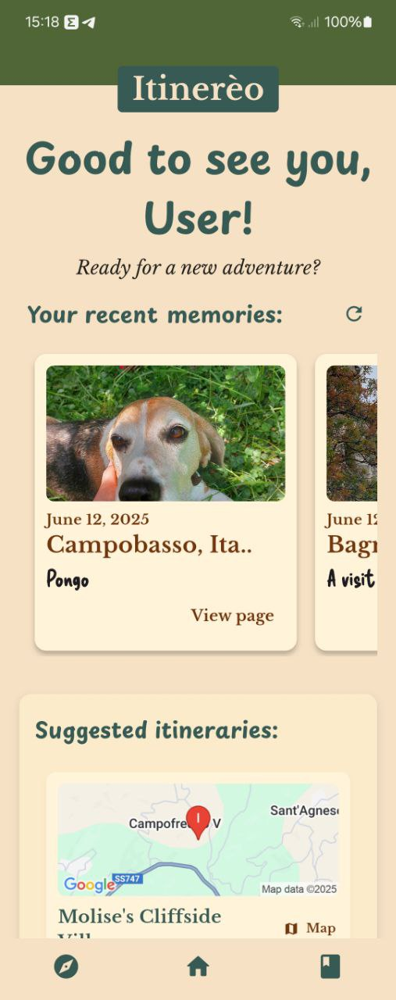
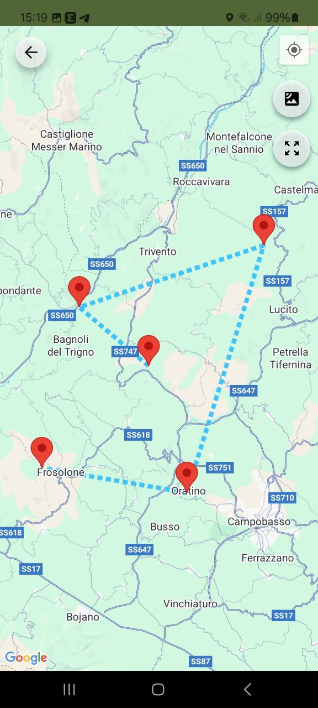
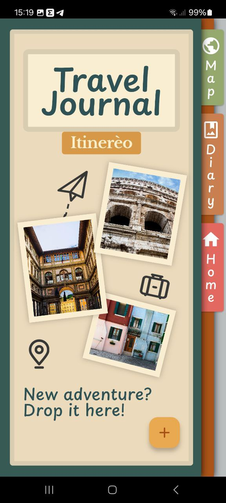
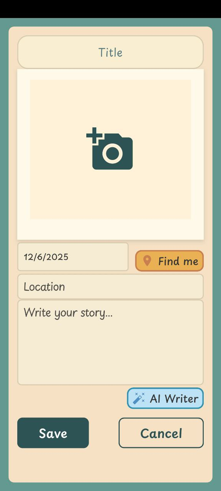
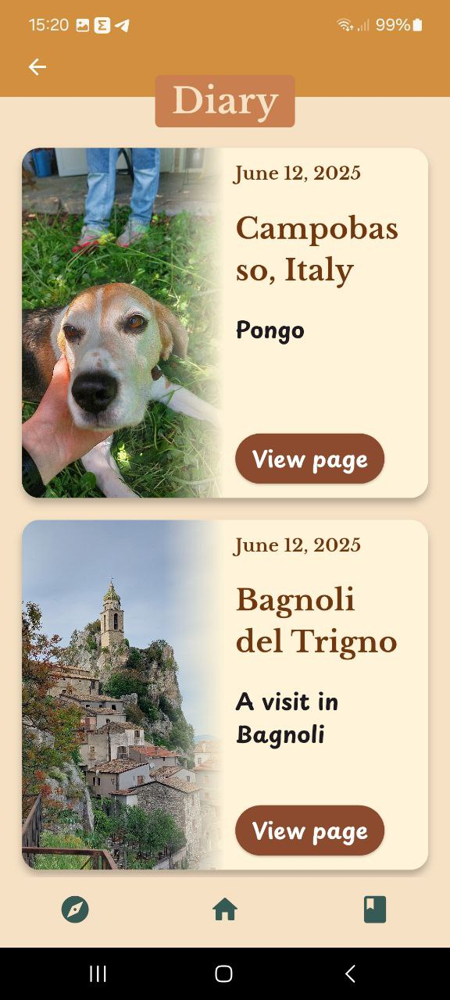
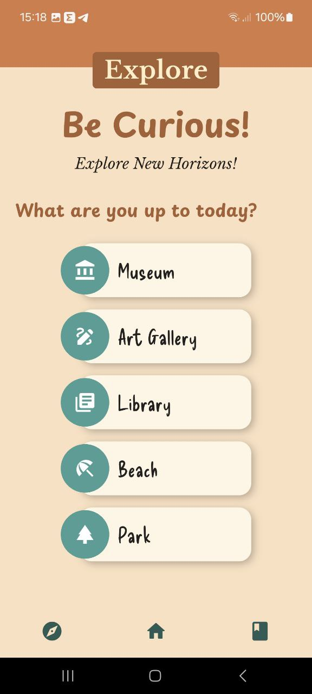
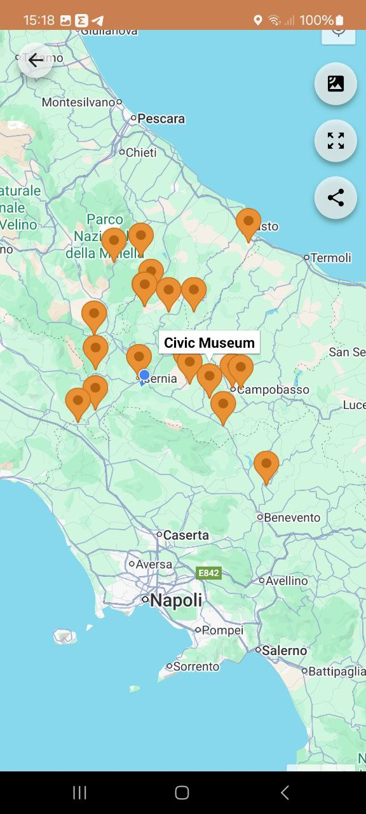

# 🖼️ Itinerèo – Your Cultural Travel Diary

Itinerèo is a mobile app designed for art lovers, culture enthusiasts, and curious travelers. It allows you to document your visits to museums, exhibitions, galleries, and cultural landmarks in a personal and visual way. Save your favorite places, write down your thoughts and experiences, and discover new places full of beauty and history.
## ✨ Key Features

- 📸 Capture and save photos: Take pictures during your visits and attach them to your diary entries.
- 🖼️ Save your favorite places: Keep track of your favourite landscapes.
- 📝 Write your thoughts and experiences with Gemini's help: Reflect on what you saw and felt during your cultural explorations or let AI help you express yourself!
- 🌍 Discover new places: Get inspired to explore new museums and hidden gems near and far.

## 📱 Built With

- **Flutter** – for cross-platform mobile development.
- **Firebase** – for cloud storage, Firestore database, and authentication.
- **Gemini AI** – for a personalized experience.
- **Camera & Gallery integration** – for capturing and uploading images.
- **Google Maps API** – for interactive maps and itineraries

## 🚀 Getting Started

To run the app locally:

```bash
flutter pub get
flutter run
```

## 💡 Inspiration

> **"Itinerèo: _tra arte e pensiero, crea il tuo sentiero_"**

_Itinerèo was created to combine the joy of travel with the beauty of memory. Museums, artworks and landscapes are not just things to see — they are **experiences** to live and **remember**._


## 📸 Screenshot

### 🏠 Home Page


### 🧳 Itinerary Map


### 📘 Diary Cover


### ➕ Add Entry


### 📝 Diary Preview


### ✏️ Entry Page


### 🗺️ Explore Page


### 🌍 Explore Map

